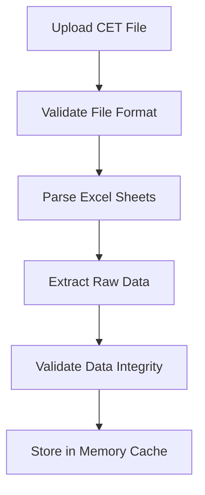
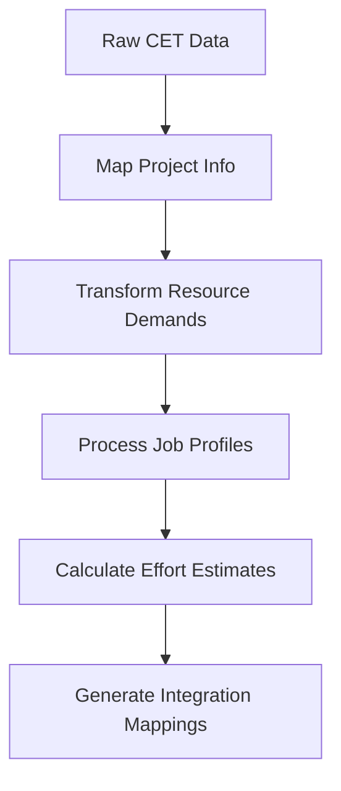
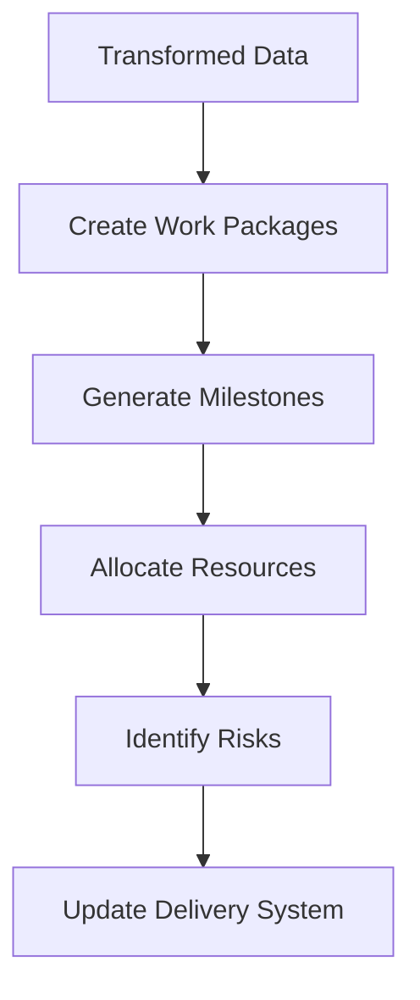

# CET v22.0 Integration Architecture

## System Overview

The CET v22.0 integration transforms your E2E Delivery Management System into a CET-powered, automated project orchestration platform. This architecture provides seamless data flow from Excel templates to production-ready delivery projects.

## Architecture Components

### 1. **Data Ingestion Layer**
```
┌─────────────────┐    ┌─────────────────┐    ┌─────────────────┐
│   CET Excel    │───▶│   File Parser   │───▶│  Data Validator │
│     File       │    │   (XLSX.js)     │    │   (Zod)         │
└─────────────────┘    └─────────────────┘    └─────────────────┘
```

### 2. **Data Transformation Layer**
```
┌─────────────────┐    ┌─────────────────┐    ┌─────────────────┐
│  Raw CET Data  │───▶│  Data Mapper    │───▶│  Delivery       │
│                 │    │  (Transformers) │    │  System Models  │
└─────────────────┘    └─────────────────┘    └─────────────────┘
```

### 3. **Integration Layer**
```
┌─────────────────┐    ┌─────────────────┐    ┌─────────────────┐
│  Transformed   │───▶│  Integration    │───▶│  Delivery       │
│     Data       │    │    Engine       │    │  Orchestrator   │
└─────────────────┘    └─────────────────┘    └─────────────────┘
```

### 4. **Presentation Layer**
```
┌─────────────────┐    ┌─────────────────┐    ┌─────────────────┐
│  Integration   │───▶│  UI Components  │───▶│  User Interface │
│     APIs       │    │   (React)       │    │   (Dashboard)   │
└─────────────────┘    └─────────────────┘    └─────────────────┘
```

## Data Flow Architecture

### Phase 1: File Processing


### Phase 2: Data Transformation


### Phase 3: System Integration


## Integration Points

### 1. **Work Package Integration**
```typescript
// CET to Work Package Mapping
interface WorkPackageMapping {
  cetProduct: string;
  workPackageName: string;
  estimatedEffort: EffortBreakdown;
  confidence: 'Low' | 'Medium' | 'High';
  dependencies: string[];
  milestones: string[];
}

// Integration Logic
function mapCETToWorkPackages(cetData: CETData): WorkPackage[] {
  return cetData.products.map(product => ({
    id: generateId(),
    name: `${product.name} Implementation`,
    description: `Implementation of ${product.name} capability`,
    type: 'Development',
    effort: distributeEffortByRole(product.totalEffort),
    dependencies: [],
    milestones: [],
    risks: [],
    status: 'Not Started'
  }));
}
```

### 2. **Milestone Integration**
```typescript
// CET Phase to Milestone Mapping
interface MilestoneMapping {
  cetPhase: number;
  milestoneName: string;
  estimatedDate: string;
  deliverables: string[];
  dependencies: string[];
}

// Integration Logic
function mapCETToMilestones(cetData: CETData): Milestone[] {
  return cetData.phases.map(phase => ({
    id: generateId(),
    name: `Phase ${phase.phaseNumber} Completion`,
    description: `Completion of Phase ${phase.phaseNumber} deliverables`,
    date: calculatePhaseEndDate(phase.endWeek),
    type: 'Phase',
    status: 'Planned',
    deliverables: generatePhaseDeliverables(phase.phaseNumber)
  }));
}
```

### 3. **Resource Integration**
```typescript
// CET Job Profile to Resource Mapping
interface ResourceMapping {
  cetJobProfile: string;
  resourceRole: string;
  skillLevel: string;
  costCenter: string;
  availability: number;
}

// Integration Logic
function mapCETToResources(cetData: CETData): Resource[] {
  return cetData.jobProfiles.map(profile => ({
    id: generateId(),
    name: profile.projectRole,
    role: profile.projectRole,
    availability: calculateAvailability(profile),
    cost: getRoleCost(profile.resourceLevel, profile.resourceCostRegion)
  }));
}
```

## API Architecture

### 1. **File Upload API**
```typescript
// POST /api/cet/upload
interface UploadRequest {
  file: File;
  projectId?: string;
  options: {
    validateOnly: boolean;
    createDraft: boolean;
    overwriteExisting: boolean;
  };
}

interface UploadResponse {
  success: boolean;
  fileId: string;
  analysisResult: CETAnalysisResult;
  integrationMappings: IntegrationMappings;
  errors: string[];
  warnings: string[];
}
```

### 2. **Analysis API**
```typescript
// GET /api/cet/analyze/{fileId}
interface AnalysisResponse {
  fileId: string;
  analysis: {
    projectInfo: ProjectInfo;
    resourceDemands: ResourceDemand[];
    effortEstimates: EffortEstimates;
    riskAssessment: RiskAssessment;
  };
  metadata: {
    processedAt: string;
    processingTime: number;
    confidence: number;
  };
}
```

### 3. **Integration API**
```typescript
// POST /api/cet/integrate/{fileId}
interface IntegrationRequest {
  fileId: string;
  options: {
    createWorkPackages: boolean;
    createMilestones: boolean;
    allocateResources: boolean;
    identifyRisks: boolean;
    updateExisting: boolean;
  };
}

interface IntegrationResponse {
  success: boolean;
  created: {
    workPackages: number;
    milestones: number;
    resources: number;
    risks: number;
  };
  updated: {
    workPackages: number;
    milestones: number;
    resources: number;
    risks: number;
  };
  errors: string[];
}
```

## Data Models

### 1. **CET Core Models**
```typescript
interface CETData {
  project: CETProject;
  phases: CETPhase[];
  products: CETProduct[];
  jobProfiles: CETJobProfile[];
  resourceDemands: CETResourceDemand[];
  lookupValues: CETLookupValue[];
  dealTypes: CETDealType[];
}

interface CETProject {
  customerName: string;
  projectName: string;
  digitalTelco: string;
  region: string;
  language: string;
  sfdcType: string;
  createdDate: string;
  status: string;
}
```

### 2. **Integration Models**
```typescript
interface IntegrationMappings {
  toWorkPackages: WorkPackageMapping[];
  toMilestones: MilestoneMapping[];
  toResources: ResourceMapping[];
  toRisks: RiskMapping[];
  confidence: {
    overall: number;
    workPackages: number;
    milestones: number;
    resources: number;
    risks: number;
  };
}
```

## Error Handling & Validation

### 1. **File Validation**
```typescript
const fileValidationRules = {
  maxSize: 50 * 1024 * 1024, // 50MB
  allowedTypes: ['.xlsx', '.xls'],
  requiredSheets: ['Attributes', 'JobProfiles'],
  maxRows: 10000,
  maxColumns: 100
};
```

### 2. **Data Validation**
```typescript
const dataValidationRules = {
  requiredFields: ['Customer Name', 'Project Name'],
  numericFields: ['Effort Hours', 'Resource Count'],
  dateFields: ['Week Date', 'Created Date'],
  referenceIntegrity: ['Job Profile', 'Product Type']
};
```

### 3. **Business Rule Validation**
```typescript
const businessValidationRules = {
  phaseSequence: 'Phases must be sequential (1-4)',
  effortConsistency: 'Total effort must match sum of weekly efforts',
  resourceAllocation: 'Resource count must be positive integers',
  timelineLogic: 'Phase end must be after phase start'
};
```

## Performance Considerations

### 1. **File Processing**
- **Chunked Processing**: Process large files in chunks
- **Memory Management**: Stream data to avoid memory issues
- **Background Processing**: Use web workers for large files
- **Progress Tracking**: Real-time progress updates

### 2. **Data Transformation**
- **Lazy Loading**: Transform data on-demand
- **Caching**: Cache transformed data for reuse
- **Batch Operations**: Process multiple items together
- **Optimized Algorithms**: Use efficient data structures

### 3. **System Integration**
- **Asynchronous Operations**: Non-blocking integration
- **Transaction Management**: Rollback on failures
- **Conflict Resolution**: Handle data conflicts gracefully
- **Audit Logging**: Track all integration activities

## Security Considerations

### 1. **File Security**
- **Virus Scanning**: Scan uploaded files
- **File Type Validation**: Strict file type checking
- **Size Limits**: Enforce file size restrictions
- **Access Control**: Restrict file access by user role

### 2. **Data Security**
- **Input Sanitization**: Clean all input data
- **SQL Injection Prevention**: Use parameterized queries
- **XSS Protection**: Sanitize output data
- **Data Encryption**: Encrypt sensitive data

### 3. **Access Control**
- **Authentication**: Verify user identity
- **Authorization**: Check user permissions
- **Audit Logging**: Log all access attempts
- **Session Management**: Secure session handling

## Deployment Architecture

### 1. **Development Environment**
```
┌─────────────────┐    ┌─────────────────┐    ┌─────────────────┐
│  Local Excel   │───▶│  Dev Server     │───▶│  Dev Database   │
│     Files      │    │  (Next.js)      │    │  (SQLite)       │
└─────────────────┘    └─────────────────┘    └─────────────────┘
```

### 2. **Staging Environment**
```
┌─────────────────┐    ┌─────────────────┐    ┌─────────────────┐
│  Test CET      │───▶│  Staging Server │───▶│  Staging DB     │
│     Files      │    │  (Vercel)       │    │  (PostgreSQL)   │
└─────────────────┘    └─────────────────┘    └─────────────────┘
```

### 3. **Production Environment**
```
┌─────────────────┐    ┌─────────────────┐    ┌─────────────────┐
│  Production    │───▶│  Production     │───▶│  Production DB  │
│     CET Files  │    │  Server         │    │  (Supabase)     │
└─────────────────┘    └─────────────────┘    └─────────────────┘
```

## Monitoring & Observability

### 1. **Performance Metrics**
- File processing time
- Data transformation efficiency
- Integration success rate
- API response times

### 2. **Error Tracking**
- File validation errors
- Data transformation failures
- Integration conflicts
- System errors

### 3. **Usage Analytics**
- File upload frequency
- Integration patterns
- User adoption rates
- Feature utilization

---

*This integration architecture provides a robust foundation for seamless CET data integration into your delivery management system.*
